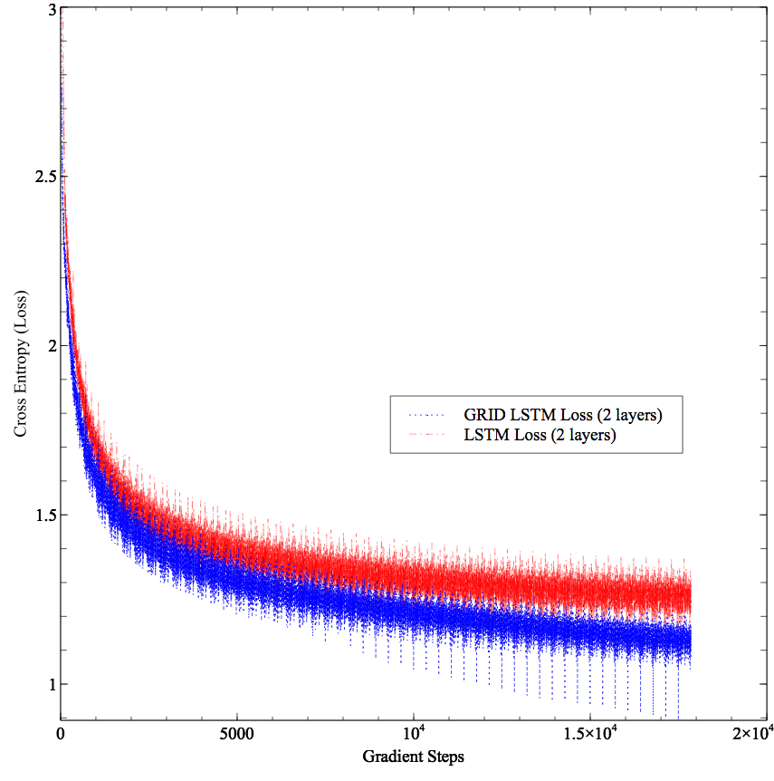

# Tensorflow Grid LSTM
Implementation of the paper https://arxiv.org/pdf/1507.01526v3.pdf

Comes with:

- [x] **Tensorflow 1.0 support!**
- [x] **Python 3 full compatibility**
- [x] **Some examples such as CharRNN are included**

The original code is available at [phvu/grid-lstm-tensorflow](https://github.com/phvu/grid-lstm-tensorflow) and is compatible with tensorflow <0.12 and Python 2.

Following the discussion in [#8191](https://github.com/tensorflow/tensorflow/issues/8191), this code is not compatible with the latest version of Tensorflow 1.1. As of today, there is no clear workaround. Instead, use:

`pip3 install tensorflow-gpu==1.0.1`

  
   <i>Stacked GRID LSTM (2 layers) vs Stacked LSTM (2 layers) on Shakespeare dataset.</i>

